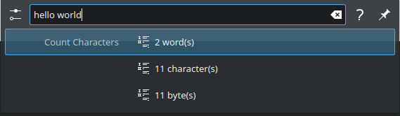

# krunner-count-characters

Plugin for Plasma 5 krunner to count the number of characters in a string.



## Why?
The original intention of this plugin was to help me quickly determine the size of a string.
I found myself very often searching the Internet for the same tool to count characters while programming or trying to align some words perfectly.

Not sure if anyone needs this as even my use case is not really the best one, but here we go!

## Installation

To install the plugin on Kubuntu, run the following commands:

1. Install required software and libraries
    ```bash
    sudo apt install cmake make g++ extra-cmake-modules qtbase5-dev qtdeclarative5-dev libkf5i18n-dev libkf5service-dev libkf5runner-dev libkf5textwidgets-dev libkf5plasmaquick5
    ```
2. Clone the repository and change into the project directory
    ```bash
    git clone https://github.com/JnCrMx/krunner-count-characters
    cd krunner-count-characters
    ```
3. Create a build folder and change into it
    ```bash
    mkdir build
    cd build
    ```
4. Configure the plugin with CMake *(Note: ``kf5-config`` is used to determine the appropriate installation paths for your system.)*
    ```bash
    cmake .. -DCMAKE_INSTALL_PREFIX=$(kf5-config --prefix) -DKDE_INSTALL_QTPLUGINDIR=$(kf5-config --qt-plugins) -DCMAKE_BUILD_TYPE=Release
    ```
5. Build the plugin (alternatively you can also just use ``make``)
    ```bash
    cmake --build .
    ```
6. Install the plugin (alternatively you can also just use ``sudo make install``)
    ```bash
    sudo cmake --build . --target install
    ```
7. (Optional) Kill ``krunner`` in order for it refresh plugins
    ```bash
    killall krunner
    ```

## Uninstallation

To uninstall, navigate back to the ``build`` directory you created in the installation process and use the following command:
```bash
sudo cmake --build . --target uninstall
```
Alternatively, a simple ``sudo make uninstall`` in that directory might be enough too.

## Possible questions and clarifications

### What is the difference between "characters" and "bytes"?
Usually every "standard" character can be represented as just one single byte.
However, many locales contain special characters (for example ``ä``, ``ü`` and ``ö`` in German), which might take more than one byte (depending on the charset).

Depending on your use-case you might want to distinguish between those two different sizes a string can have.
Therefore both are shown seperately.

- "characters" refers to the total number of real world characters (``a`` is one character, ``ä`` is also one character); this is the ``length()`` of a ``QString``.
- "bytes" refers to the size of the string if it was encoded in UTF-8 (as returned by ``QString.toUtf8()``); this is the ``length()`` of the ``QByteArray`` returned by said function.

You might want to experiment a little by trying different strings containing special characters! :smile:

### What is a "word"?
For this plugin a the number of words is defined as the number of occurrence of the regual, normal ASCII space character (``' ' = 0x20``) in the string **plus one**.

For example ``"Hello World!"`` consists of 2 words by this definition while ``"Hello World !"`` consists of 3.
